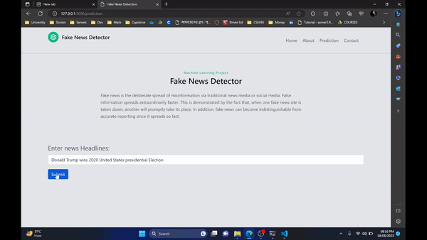

# Fake News Detector
The objective of a fake news detector is to accurately identify and flag news articles or information that are fabricated, misleading, or intentionally deceptive. Using machine learning model, the detector aims to differentiate between reliable and unreliable content, helping users make informed decisions about the information they consume. Ultimately, the goal is to enhance media literacy and combat the spread of misinformation.

# Demo



## Run Locally

Clone the project

```bash
  git clone https://github.com/SazeebulBashar/fake-news-detector.git
```

Go to the project directory

```bash
  cd fake-news-detector
```

### Install dependencies

Download Python:

Visit the official Python website: https://www.python.org/downloads/

Then run the below commands:
```bash
  pip install Flask
```
```bash
  pip install scikit-learn
```
```bash
  pip install numpy
```
```bash
  pip install pickle
```
To run this project go to the fake-news-detector directory/folder and open the cmd in that directory. Then just run the below command.


Start the server

```bash
  python app.py
```
Open the link from the command prompt. Press ctrl + left click.                                                          
Or                                                                                                                      
Go to this url http://127.0.0.1:5000                                                                         

If everything is ok, then you should see like this...


## 🚀 About Me
As a data science graduate, my interests are in Python, Pandas,scikit-learn and SQL, with expertise in statistical analysis, machine learning and deep learning. Detail-oriented and driven, I am eager to contribute to innovative projects and make a positive impact as a data scientist.


